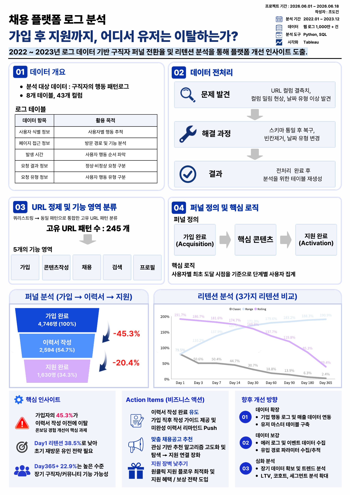
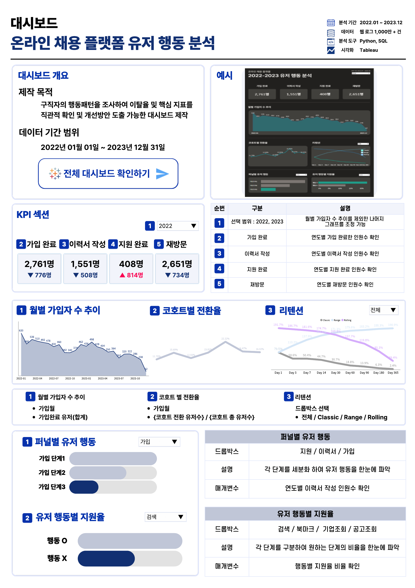

# 채용 플랫폼 로그 분석 (Job Platform Log Analysis)

채용 플랫폼의 원본 접근 로그를 바탕으로 AARRR 프레임워크 기준 **가입 → 이력서 작성 → 지원 완료** 퍼널을 정의하고, 전환율·리텐션·이탈 지점을 분석한 프로젝트입니다.

> ⚠️ **데이터 출처 안내**
>
> 본 프로젝트에서 사용한 원본 데이터는 실제 기업으로부터 정식 계약을 통해 제공받은 자료로, 계약에 따라 원본 데이터 파일 자체의 공유·복제·배포 및 원본을 유추/복원할 수 있는 형태의 공유가 금지되어 있습니다. 이 문서에는 **원본 데이터, DB 접속 정보, 실제 테이블/컬럼명, 실제 서비스 라우트 경로**를 포함하지 않으며, 분석 과정과 결과(산출물)만 개인 포트폴리오 목적으로 공유합니다.

## 📄 한눈에 보기

| 항목 | 내용 |
|---|---|
| 분석 기간 | 2022-01-01 ~ 2023-12-31 |
| 로그 행 수 | 16,468,531건 |
| 고유 유저 수 | 21,340명 |
| 분석 방법 | AARRR 퍼널 분석, 코호트 기반 리텐션(Classic/Range/Rolling), 이탈 사유 분석 |
| 도구 | MySQL, Python (pandas, matplotlib, seaborn), Tableau |
| 작성자 | 조도건 |

## 퍼널 정의

| 단계 | 이벤트 기준 |
|---|---|
| Acquisition (가입 완료) | 가입 완료 이벤트 (소셜 가입 포함) |
| Activation ① (이력서 작성) | 이력서 작성 1·2단계 이벤트 |
| Activation ② (지원) | 지원 1~4단계 및 지원 완료 이벤트 |

- 각 단계는 유저별 최초 발생 시각 기준으로 집계
- 직전 단계보다 이후 시점에 발생한 경우에만 유효 전환으로 인정 (역행 전환 배제)

## 주요 분석 결과

### 가입 스텝 퍼널

| 단계 | 전환율 |
|---|---|
| step1 → step2 | 94.3% |
| step2 → step3 (가입완료) | 79.1% |

가입 마지막 단계(개인정보/약관 동의 등)에서 이탈이 가장 큽니다.

### 이력서 작성 퍼널

- 가입완료 유저 중 **62.5%만 이력서 step1**까지 진입 — 애초에 이력서를 작성하지 않는 유저가 상당수
- 일단 step1을 시작하면 **step2까지는 87.5%**로 순조롭게 진행

### 지원 퍼널

| 단계 | 전환율 |
|---|---|
| step1 → step2 | 95.1% / 94.1% |
| step2 → step3 | 82.8% |
| step3 → step4 | 65.1% |
| 최종 완료 | 34.1% |

지원서 후반부(step3→step4)와 제출 단계에서 이탈이 집중되어, 해당 구간 UX 개선이 필요해 보입니다.

### 리텐션 (Classic 기준)

| 기준일 | 리텐션 |
|---|---|
| Day 1 | 38.5% |
| Day 7 | 24.7% |
| Day 30 | 15.1% |
| Day 365 | 1.7% |

초반 이탈이 크고 이후엔 완만해집니다. 다만 **Rolling 기준으로는 Day 180+ 유저의 45.1%가 최소 한 번은 재방문** — 완전히 이탈한 것이 아니라 간헐적으로 돌아오는 유저층이 상당함을 시사합니다.

### 월별 가입자 추이

2022-01(317명) → 2023-12(31명)로 지속 감소 추세.

### 미전환 유저의 마지막 행동

가입은 완료했지만 지원까지 이어지지 않은 유저의 마지막 행동은 **프로필/설정, 채용공고 탐색**이 가장 많았습니다. 공고까지는 살펴보지만 지원으로 이어지지 않는 패턴으로, 탐색과 지원 사이의 전환 장치가 부족한 것으로 보입니다.

### 원클릭 지원 기능 효과

원클릭 지원 버튼을 클릭한 3,094명 중 거의 대부분인 **3,077명이 실제 지원을 완료**했습니다. 이 중 이력서 없이 지원한 유저도 899명으로, 원클릭 지원 기능이 전환에 실질적으로 기여하는 것으로 확인됩니다.

## 📊 대시보드

구직자 행동 패턴을 조사해 이탈율과 핵심 지표를 직관적으로 확인할 수 있는 Tableau 대시보드를 함께 제작했습니다. (기간 필터, 퍼널별 유저 행동 필터, 유저 행동별 지원율 필터 제공)

## 핵심 인사이트

**1. 가입 마지막 단계가 첫 이탈 관문**
step2 → step3(가입완료) 전환율이 79.1%로, 개인정보·약관 동의 등 마지막 단계에서 이탈이 가장 큽니다.

**2. 이력서 작성 자체가 진입 장벽**
가입완료 유저의 37.5%가 이력서 작성을 아예 시작하지 않습니다. 일단 시작하면 완주율은 높아, "시작하게 만드는 것"이 핵심 과제입니다.

**3. 지원서 제출 단계 UX 개선 필요**
지원 퍼널의 최종 완료율은 34.1%에 불과하며, 특히 step3→step4 구간(82.8%→65.1%)에서 이탈이 집중됩니다.

**4. 완전 이탈이 아닌 '휴면 후 복귀' 유저층 존재**
Classic 리텐션은 빠르게 감소하지만, Rolling 기준으로는 장기 휴면 후에도 재방문하는 유저 비중이 상당합니다 (Day180+ 45.1%).

**5. 원클릭 지원은 검증된 전환 장치**
클릭 유저의 99% 이상이 실제 지원을 완료해, 지원 단계 마찰을 줄이는 기능으로서 효과가 확인되었습니다.

## 결론

채용 플랫폼의 핵심 이탈 지점은 ① 가입 마지막 단계, ② 이력서 작성 시작 여부, ③ 지원서 제출 단계 세 곳으로 요약됩니다. 특히 원클릭 지원처럼 마찰을 줄이는 기능이 실제로 전환에 기여한다는 점에서, 지원서 작성 단계의 입력 부담을 낮추는 방향의 개선이 우선순위로 판단됩니다. 다음 단계로는 이력서 작성 시작률을 높이기 위한 온보딩 개선, 그리고 지원서 후반부 이탈 원인에 대한 세부 UX 분석을 진행할 예정입니다.

## 상세 자료

- [분석 원페이지 요약본 (PDF)](./one_paper/채용_플랫폼_로그_분석.pdf)
